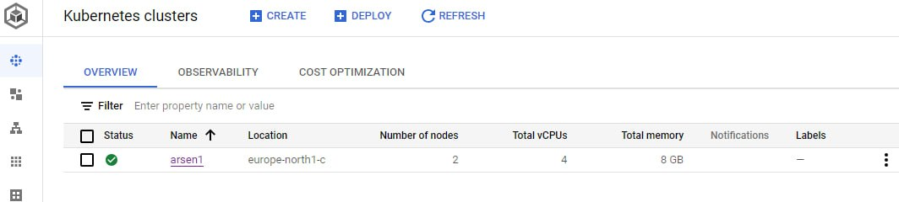

# Django site
Сайт заделоен по адресу [arsxak.ru](https://arsxak.ru).
Использовалось Google Cloud Platform (GKE)

Выделенные ресурсы:


Докеризированный сайт на Django для экспериментов с Kubernetes.

Внутри конейнера Django запускается с помощью Nginx Unit, не путать с Nginx. Сервер Nginx Unit выполняет сразу две функции: как веб-сервер он раздаёт файлы статики и медиа, а в роли сервера-приложений он запускает Python и Django. Таким образом Nginx Unit заменяет собой связку из двух сервисов Nginx и Gunicorn/uWSGI. [Подробнее про Nginx Unit](https://unit.nginx.org/).

## Как запустить dev-версию

Запустите базу данных и сайт:

```shell-session
$ docker-compose up
```

В новом терминале не выключая сайт запустите команды для настройки базы данных:

```shell-session
$ docker-compose run web ./manage.py migrate  # создаём/обновляем таблицы в БД
$ docker-compose run web ./manage.py createsuperuser
```

Для тонкой настройки Docker Compose используйте переменные окружения. Их названия отличаются от тех, что задаёт docker-образа, сделано это чтобы избежать конфликта имён. Внутри docker-compose.yaml настраиваются сразу несколько образов, у каждого свои переменные окружения, и поэтому их названия могут случайно пересечься. Чтобы не было конфликтов к названиям переменных окружения добавлены префиксы по названию сервиса. Список доступных переменных можно найти внутри файла [`docker-compose.yml`](./docker-compose.yml).

## Переменные окружения

Образ с Django считывает настройки из переменных окружения:

`SECRET_KEY` -- обязательная секретная настройка Django. Это соль для генерации хэшей. Значение может быть любым, важно лишь, чтобы оно никому не было известно. [Документация Django](https://docs.djangoproject.com/en/3.2/ref/settings/#secret-key).

`DEBUG` -- настройка Django для включения отладочного режима. Принимает значения `TRUE` или `FALSE`. [Документация Django](https://docs.djangoproject.com/en/3.2/ref/settings/#std:setting-DEBUG).

`ALLOWED_HOSTS` -- настройка Django со списком разрешённых адресов. Если запрос прилетит на другой адрес, то сайт ответит ошибкой 400. Можно перечислить несколько адресов через запятую, например `127.0.0.1,192.168.0.1,site.test`. [Документация Django](https://docs.djangoproject.com/en/3.2/ref/settings/#allowed-hosts).

`DATABASE_URL` -- адрес для подключения к базе данных PostgreSQL. Другие СУБД сайт не поддерживает. [Формат записи](https://github.com/jacobian/dj-database-url#url-schema).

## Деплой с помощью Kubernetes

Перед деплоем необходимо прописать переменные окружения в файле django-config.yaml:
```yaml
apiVersion: v1
kind: ConfigMap
metadata:
  name: django-config
  labels:
    app: django
    tier: django
data:
  SECRET_KEY: ""
  DEBUG: ""
  DATABASE_URL: ""
  ALLOWED_HOSTS: ""
```
Далее выполнить команду ниже, чтобы применить их:
```
kubectl apply -f django-config.yaml
```
Далее для запуска Deployment и Service выполните команду: 
```
kubectl apply -f django-deployment.yaml
```
Для доступа web-сервиса с "наружи" пропишите необходимые данные в файле `ingress-hosts.yaml`, а именно:
```yaml
host: "доменное имя"
...
service:
  name: "имя сервиса"
```
Для удаления устаревших сессий предусмотрен CronJob, для применения выполните команду:
```
kubectl create -f cronjob.yaml
```
Для применения миграций выполните job из файла `management_job.yaml`:
```
kubectl apply -f management_job.yaml 
```